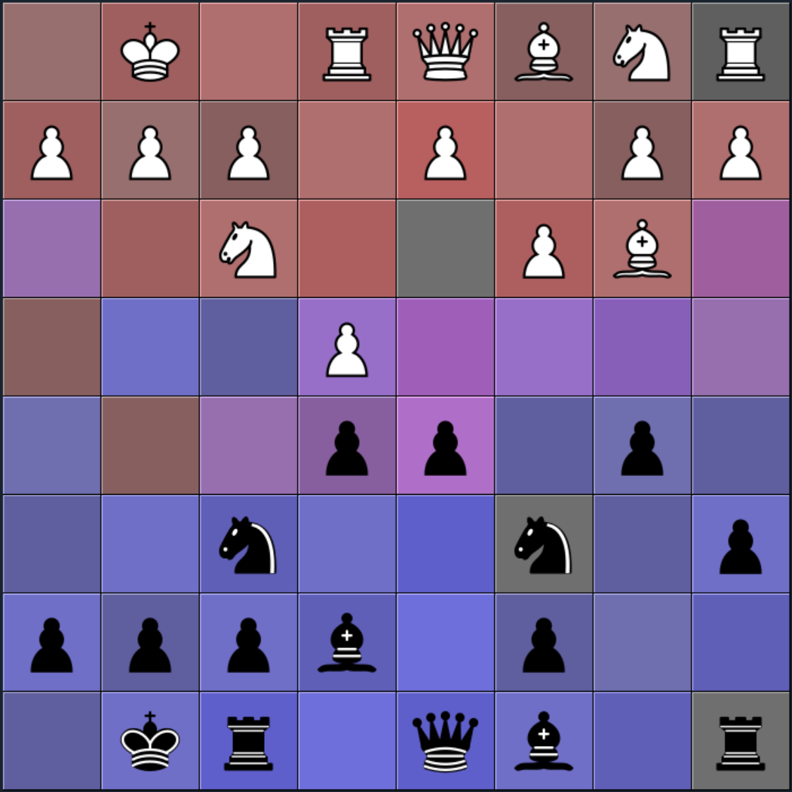

# Chessacabra
Chessacabra is a chess attack visualizer. It overlays a color display of the attack spaces for each side in two primary colors on the board with increasing saturation based on the number of pieces attacking. But the following image will probably be clearer than that sentence:



# Setup
Requires Python 3.9 or later. Uses PySimpleGUI and python-chess, which can be installed by running the following in the directory with requirements.txt:
```
pip install -r requirements.txt
```

# Notes
Tested on Windows and Mac. Setting button image size doesn't work on Mac.

# Credits
https://commons.wikimedia.org/wiki/Category:SVG_chess_pieces

https://en.wikipedia.org/wiki/User:Cburnett/GFDL_images/Chess
